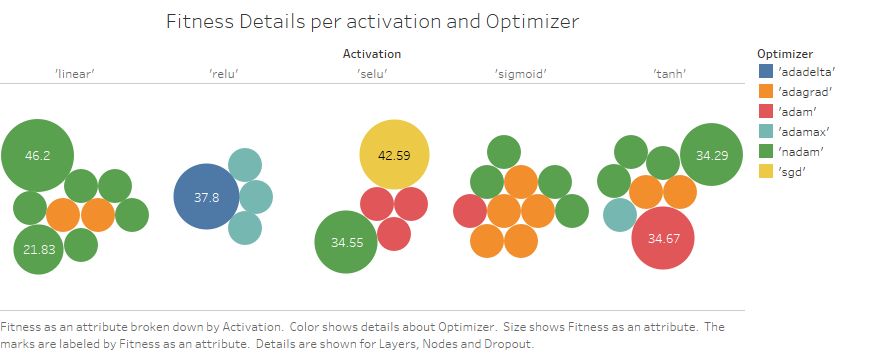
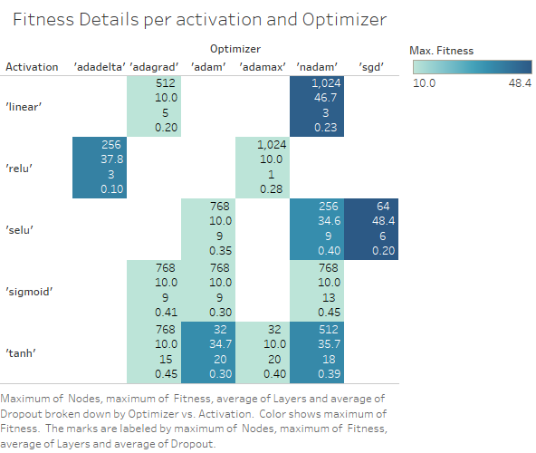
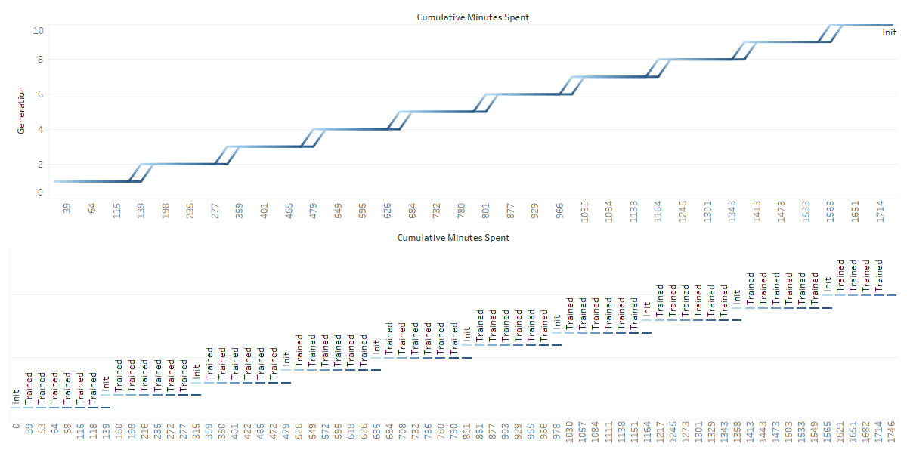
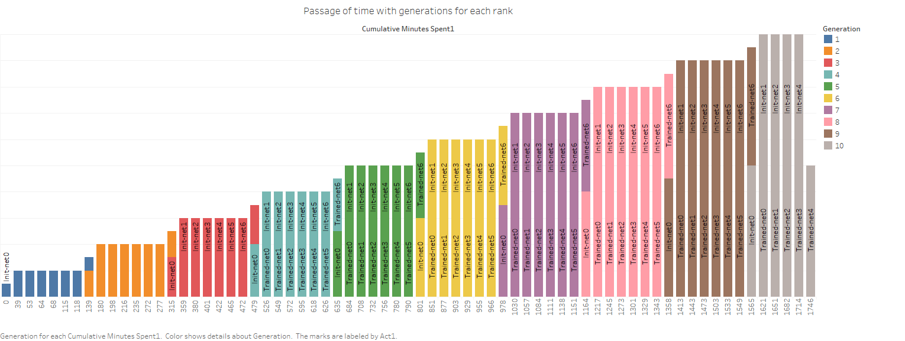
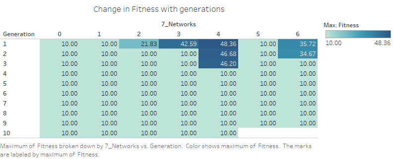

# GeneticsInspiredNeuralNetworkTuning

## Introduction:

The first analysis for optimizing neural network is done using evolutionary genetics. 
Search space consists of 5 hyper-parameters: activation functions, optimizers, hidden layers, nodes in hidden layers and dropout.

Seven activation functions included are: sigmoid, elu, selu, relu, tanh, hard_sigmoid, linear. 
In addition to this, optimizers include sgd, rmsprop, adagrad, adadelta, adam, adamax, nadam. 
Hidden layers range from 1-20.
Nodes/neurons range from 32-1024.
Dropouts range from 0.1 to 0.5.

Using genetic algorithm, the networks are initialized using random sets of configuration variables. These networks then exchange hyper-parameters with each others(a.k.a. crossover). The networks get the change to mutate @2%. This process is called as breeding. The process repeats for generations. Due to memory and time constraints, the whole code ran for 1day-5hours, fetching results for 10 generations.

Number of networks initialized = 7
Processors used  = 1

## Requirements:

1. Server: Scientific Linux release 7.5 (Nitrogen)
2. conda 4.5.10
3. Python 2.7.15 :: Anaconda, Inc.
4. numpy 1.15.0
5. Keras 2.2.2
6. Tensorflow 1.5
7. gcc: gcc (GCC) 4.8.5 20150623 (Red Hat 4.8.5-28)
8. ld: ldd (GNU libc) 2.17

## Usage:
    python snnt.py
This saves the output in a log file.

A quick crossstab of the tested combinations of hyper-parameters is shown below. It can be easily seen that while evaluating hyper-parameter combinations for training out of 7 activation functions, hard_sigmoid and elu couldn't come in any set of combinations for the 7 networks, in any of the 10 generations.  

A more detailed plot is as follows. The size of the bubbles denote the fitness. While with linear activation function, 'nadam' optimizer has been more frequently tested, with sigmoid activation function, adagrad is more frequently tested.   

The following fitness - heatmap shows number of nodes, fitness, layers and dropout percentage. 'sgd' optimizer has been tested once with 'selu' and showed best accuracy of 48.4%. Linear activation function showed good accuracy with 'nadam' when the number of nodes are 1024 in 3 hidden layers. 

A time lapse of various generations at rank level is shown below. Since, it's a sequential code, the graphs can be seen in a beautiful stair-case format. Total time taken is ~29 hours for 10 generations. Since tensorflow saves the previous model data, the time taken increases with generation with 1st generation taking 139 minutes and going as high as 200 minutes in later generations.
 

Since, initialization of hyper-parameters is random and total possible combinations of hyper-parameters is tens of thousands, it is highly unlikely to get the best combination initialized of bred. To check this, a population of 70 networks is initialized on one processor. The code ran for 2days(time limit of TCHPC-Boyle cluster), running only for 1 generation(70 networks trained) and training 28 networks of the second generation.

A snippet of change in fitness with ranks in the first case with initialization of 7 networks and second case where 70 networks are initialized is as follows:  

